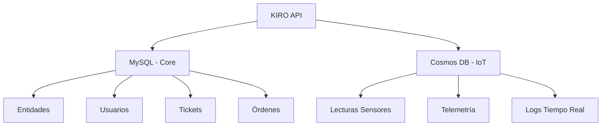

# JELABBC PARA KIRO AMAZON - LÓGICA DE ARQUITECTURA Y ADAPTACIÓN

## 📊 RESUMEN EJECUTIVO

Este documento complementa la sección 14 del Ecosistema JELABBC especificando la **lógica de arquitectura, decisiones técnicas y estrategia de adaptación** del ecosistema para el caso de uso de KIRO Amazon.

### Contexto de KIRO Amazon
- **Cliente**: Amazon/Embark
- **Objetivo**: Plataforma de gestión de operaciones internas
- **Infraestructura**: Entorno corporativo con altos estándares de seguridad
- **Cumplimiento**: ISO 27001, SOC 2, políticas internas Amazon

---

## 1️⃣ ARQUITECTURA Y SETUP - LÓGICA DE DECISIÓN

### 1.1 Decisión: Monolito vs Microservicios

**SELECCIÓN: Arquitectura Híbrida Modular**

```
┌────────────────────────────────────────┐
│      KIRO AMAZON - ARQUITECTURA       │
└────────────────────────────────────────┘
         │
         │
┌────────┴────────┐
│  CORE MONOLÍTICO  │  ⇐ Razón: Desarrollo rápido MVP
│  (FASE 1-3)      │     (ASP.NET VB.NET + MySQL)
└────────┬────────┘
         │
         ├────────────────────────────────┐
         │                                │
┌────────┴────────┐      ┌────────┴────────┐
│ MÓDULOS IA       │      │ MÓDULO IoT      │
│ (Microservicio)  │      │ (Microservicio)  │
│ Azure OpenAI     │      │ Azure IoT Hub    │
│ Python/FastAPI   │      │ .NET Core        │
└──────────────────┘      └──────────────────┘
```

**¿Por qué esta arquitectura?**

1. **Core Monolítico (VB.NET/ASP.NET)**:
   - ✅ Equipo actual domina VB.NET
   - ✅ Base de código existente aprovechable
   - ✅ Desarrollo MVP en 3-8 semanas
   - ✅ Menor complejidad operativa inicial
   - ⚠️ Límite: No escala horizontalmente fácil

2. **Módulos IA como Microservicios**:
   - ✅ Python es estándar para ML/AI
   - ✅ Puede escalar independientemente
   - ✅ Actualización sin afectar core
   - ✅ Integración con Azure OpenAI nativa

3. **Módulo IoT como Microservicio**:
   - ✅ Maneja alto volumen de datos IoT
   - ✅ Desacoplado del core de negocio
   - ✅ .NET Core para consistencia con ecosistema Microsoft

---

### 1.2 Estrategia de Base de Datos

**SELECCIÓN: MySQL para Core + Azure Cosmos DB para IoT**



**¿Por qué?**

| Aspecto | MySQL (Core) | Cosmos DB (IoT) |
|---------|-------------|------------------|
| **Tipo** | Relacional | NoSQL Document |
| **Uso** | Transacciones ACID | Alta escritura |
| **Volumen** | Moderado | Masivo (1000s/seg) |
| **Queries** | SQL complejo | Queries simples |
| **Costo** | Predecible | Escala con uso |
| **Backup** | Point-in-time | Geo-replicación |

**MIGRACIÓN FUTURA:**
Cuando el core crezca > 100K usuarios:
- Migrar a **Azure SQL Database Premium** (soporte VB.NET nativo)
- O refactorizar a **.NET Core + PostgreSQL**

---

### 1.3 Decisión de Hosting

**SELECCIÓN: Azure App Service + Azure Container Instances**

**Fase 1-2 (MVP a Producción inicial):**
```
Azure App Service (Windows)
├── KIRO-Core (VB.NET)
└── Azure MySQL Flexible Server

Azure Container Instances
├── IA-Agent (Python/FastAPI)
└── IoT-Processor (.NET Core)
```

**Fase 3+ (Escala):**
```
Azure Kubernetes Service (AKS)
├── kiro-core (convertido a .NET Core)
├── ia-agent (Python)
├── iot-processor
└── api-gateway (NGINX/APIM)
```

**Justificación:**
- App Service: 👍 Soporte VB.NET out-of-the-box, CI/CD integrado
- ACI: 👍 Rápido para MVP, sin overhead de K8s
- AKS: 🚀 Solo cuando tengamos > 20 clientes concurrentes

---

## 2️⃣ INTEGRACIONES KIRO-AMAZON ESPECÍFICAS

### 2.1 Integración con Infraestructura Amazon

**Requerimientos Técnicos:**

1. **Networking:**
   ```
   ┌───────────────────────────────┐
   │   Amazon Corporate Network    │
   │   (VPN / ExpressRoute)         │
   └─────────────┬──────────────────┘
                │
                │ Azure VNet Peering
                │
   ┌────────────┴──────────────────┐
   │  Azure VNET KIRO (Privado)    │
   │  - Subnet Core: 10.0.1.0/24   │
   │  - Subnet IoT: 10.0.2.0/24    │
   │  - Subnet IA: 10.0.3.0/24     │
   └───────────────────────────────┘
   ```

2. **Autenticación:**
   - SSO con Amazon LDAP/AD
   - Azure AD B2B con federación
   - OAuth2 + SAML 2.0

3. **Logging Centralizado:**
   ```
   KIRO Logs → Azure Log Analytics → Export API → Amazon Splunk/CloudWatch
   ```

### 2.2 Adaptaciones de Seguridad

**KIRO debe cumplir:**

| Requerimiento | Implementación KIRO |
|---------------|----------------------|
| **Encriptación en reposo** | TDE en MySQL + Cosmos DB encryption at rest |
| **Encriptación en tránsito** | TLS 1.3 obligatorio en todos los endpoints |
| **Gestión de secretos** | Azure Key Vault (NO hardcoded) |
| **Auditoría** | Log Analytics + Event Grid → SIEM Amazon |
| **Control de acceso** | RBAC + Conditional Access (geofencing) |
| **Escaneo de vulnerabilidades** | Azure Defender + Dependabot |
| **Pen Testing** | Anual por terceros certificados |

---

## 3️⃣ MÓDULOS CORE PARA KIRO

### 3.1 Priorización de Módulos

KIRO NO necesita todos los módulos de JELABBC. Priorización:

**FASE 1 (Semanas 1-8): MVP**
✅ Módulo de Entidades (Buildings/Facilities)
✅ Módulo de Usuarios y Roles
✅ Módulo de Tickets (Maintenance)
✅ Módulo de Órdenes de Compra Básico

**FASE 2 (Semanas 9-16): Extensiones**
✅ Módulo IoT (Sensores)
✅ Agente IA para Tickets
✅ Dashboards y Reportes

**FASE 3 (Semanas 17-24): Avanzado**
✅ Módulo Agricultura (si aplica)
✅ Agente de Voz
✅ Marketplace Integraciones

**NO INCLUIR (para KIRO):**
❌ Módulo de Condominios/Residentes (no aplica)
❌ Módulo de Facturación (Amazon usa SAP)

### 3.2 Modelo de Datos Específico KIRO

**Entidades Clave:**

```sql
-- FACILITIES (Entidades Físicas)
CREATE TABLE Facilities (
    id INT PRIMARY KEY,
    name VARCHAR(200),
    type ENUM('warehouse', 'office', 'datacenter'),
    location_lat DECIMAL(10,8),
    location_lng DECIMAL(11,8),
    amazon_site_code VARCHAR(50), -- Código interno Amazon
    created_at TIMESTAMP
);

-- TICKETS (Mantenimiento/Soporte)
CREATE TABLE Tickets (
    id INT PRIMARY KEY,
    facility_id INT,
    type ENUM('maintenance', 'incident', 'request'),
    priority ENUM('low', 'medium', 'high', 'critical'),
    status ENUM('open', 'assigned', 'in_progress', 'resolved'),
    ai_classification JSON, -- Tags automáticos por IA
    sla_deadline TIMESTAMP,
    amazon_incident_id VARCHAR(100), -- Link a sistema Amazon
    FOREIGN KEY (facility_id) REFERENCES Facilities(id)
);

-- IOT_READINGS (Sensores)
CREATE TABLE IoT_Readings (
    id BIGINT PRIMARY KEY,
    sensor_id VARCHAR(100),
    facility_id INT,
    metric_type VARCHAR(50), -- temp, humidity, power, etc
    value DECIMAL(10,2),
    unit VARCHAR(20),
    timestamp TIMESTAMP,
    anomaly_detected BOOLEAN, -- IA detecta anomalías
    INDEX idx_timestamp (timestamp),
    INDEX idx_sensor (sensor_id, timestamp)
) PARTITION BY RANGE (YEAR(timestamp));
```

---

## 4️⃣ CI/CD Y DEVOPS PARA KIRO

### 4.1 Pipeline de Despliegue

**Azure DevOps Pipeline:**

```yaml
# azure-pipelines.yml
trigger:
  branches:
    include:
      - main
      - develop

stages:
  - stage: Build
    jobs:
      - job: BuildCore
        steps:
          - task: NuGetRestore@1
          - task: VSBuild@1
            inputs:
              solution: 'KIRO.Core.sln'
          - task: VSTest@2 # Unit tests
          
      - job: BuildIA
        steps:
          - script: |
              pip install -r requirements.txt
              pytest tests/
          - task: Docker@2
            inputs:
              command: 'buildAndPush'
              repository: 'kiro-ia-agent'
              
  - stage: Deploy_Dev
    dependsOn: Build
    jobs:
      - deployment: DeployToDev
        environment: 'KIRO-Dev'
        strategy:
          runOnce:
            deploy:
              steps:
                - task: AzureWebApp@1
                  inputs:
                    appName: 'kiro-dev'
                    
  - stage: Deploy_Prod
    dependsOn: Deploy_Dev
    condition: and(succeeded(), eq(variables['Build.SourceBranch'], 'refs/heads/main'))
    jobs:
      - deployment: DeployToProd
        environment: 'KIRO-Prod'
        strategy:
          runOnce:
            deploy:
              steps:
                - task: AzureWebApp@1
                  inputs:
                    appName: 'kiro-prod'
                - task: RunLoadTest@1 # Smoke tests post-deploy
```

### 4.2 Estrategia de Testing

| Tipo de Test | Herramienta | Cobertura Mínima |
|--------------|-------------|-------------------|
| **Unit Tests** | xUnit / MSTest | 70% |
| **Integration Tests** | TestServer | APIs críticas |
| **End-to-End** | Selenium / Playwright | Flujos principales |
| **Performance** | JMeter / k6 | 1000 req/seg |
| **Security** | OWASP ZAP / Burp | Mensual |
| **Pen Testing** | Externo certificado | Anual |

---

## 5️⃣ COSTOS ESTIMADOS (KIRO AMAZON)

### 5.1 Infraestructura Azure

**Fase MVP (3 meses):**

| Servicio | Configuración | Costo/Mes |
|----------|----------------|------------|
| App Service | P1v3 (Windows) | $150 |
| MySQL Flexible | B1ms (2 vCores) | $60 |
| Cosmos DB | Throughput 400 RU/s | $25 |
| Container Instances | 2x (1 vCPU, 1.5GB) | $40 |
| Azure OpenAI | GPT-4 10K tokens/dia | $100 |
| Storage | 100GB Blob + 50GB Files | $15 |
| Log Analytics | 5GB/dia | $20 |
| **TOTAL MVP** | | **~$410/mes** |

**Fase Producción (12 meses, 50 clientes):**

| Servicio | Configuración | Costo/Mes |
|----------|----------------|------------|
| App Service | P3v3 (8 cores, 32GB) | $600 |
| MySQL | GP 4 vCores | $350 |
| Cosmos DB | 4000 RU/s + storage | $200 |
| AKS | 3 nodes D4s_v3 | $500 |
| Azure OpenAI | GPT-4 100K tokens/dia | $800 |
| IoT Hub | S2 tier | $250 |
| Networking | VPN Gateway + bandwidth | $200 |
| Backup & DR | Geo-redundant | $150 |
| **TOTAL PRODUCCIÓN** | | **~$3,050/mes** |

### 5.2 Equipo Requerido

**FASE 1 (Semanas 1-8):**
- 2 Backend (.NET): $120K/año c/u
- 1 DevOps: $130K/año
- 1 QA: $90K/año
- 1 PM: $110K/año
**TOTAL: $570K/año**

**FASE 2-3 (Semanas 9-24):**
- Agregar: 1 IA Engineer ($140K), 1 Frontend ($100K)
**TOTAL: $810K/año**

---

## 6️⃣ RIESGOS Y MITIGACIONES

| Riesgo | Probabilidad | Impacto | Mitigación |
|--------|--------------|---------|-------------|
| **VB.NET legacy dificulta escalamiento** | Alta | Alto | Plan de migración incremental a .NET Core en Fase 3 |
| **Amazon cambia políticas de seguridad** | Media | Alto | Arquitectura desacoplada, adaptar capa de integración |
| **Costos Azure exceden presupuesto** | Media | Medio | Alertas de costos, optimización continua, reserved instances |
| **IA genera respuestas incorrectas** | Alta | Alto | Human-in-the-loop, validación manual tickets críticos |
| **Integración con SSO Amazon falla** | Baja | Alto | Fallback a autenticación local temporal |

---

## 7️⃣ CRITERIOS DE ÉXITO

### KPIs Fase 1 (MVP):
✅ Sistema funcional con 3 facilities piloto
✅ 100 tickets procesados sin errores críticos
✅ Tiempo de respuesta API < 500ms (p95)
✅ Uptime > 99%
✅ Integración SSO Amazon funcionando

### KPIs Fase 2 (Extensiones):
✅ IA clasifica tickets con 85% precisión
✅ 10,000 lecturas IoT/hora procesadas
✅ Dashboard ejecutivo en tiempo real
✅ Satisfacción usuarios > 4.0/5.0

### KPIs Fase 3 (Escala):
✅ 50+ facilidades activas
✅ 1M+ tickets procesados acumulados
✅ Reducción 30% tiempo resolución tickets
✅ ROI positivo vs sistema anterior

---

## 8️⃣ PRÓXIMOS PASOS INMEDIATOS

### Semana 1-2: Setup Inicial

**Día 1-3:**
```bash
# 1. Crear estructura de proyecto
mkdir KIRO-Amazon
cd KIRO-Amazon

# 2. Inicializar repositorios
git init

# 3. Crear proyecto VB.NET
devenv /Command "File.NewProject VB.NET Web Application"

# 4. Setup Azure resources con Bicep
az deployment group create \
  --resource-group rg-kiro-dev \
  --template-file infra/main.bicep
```

**Día 4-7:**
- Implementar capa de datos (MySQL schema)
- Crear modelos de entidad (Facilities, Tickets)
- Implementar autenticación basic (local, preparar SSO)

**Día 8-10:**
- API REST endpoints básicos (CRUD Facilities, Tickets)
- Unit tests iniciales
- Setup pipeline CI/CD

### Semana 3-4: Módulos Core

- Módulo de Entidades completo
- Módulo de Tickets funcional
- Web UI básico (DevExpress)
- Deploy a ambiente Dev

### Semana 5-8: Integraciones

- Integración SSO Amazon
- Inicio módulo IA (Python)
- Módulo IoT bHasic
- Testing integral
- Deploy a ambiente QA
- **Demo con stakeholders Amazon**

---

## 📦 ENTREGABLES FINALES

### Documentación:
✅ Manual de usuario (ES + EN)
✅ Documentación API (OpenAPI/Swagger)
✅ Runbooks operacionales
✅ Plan de DR (Disaster Recovery)
✅ Matriz de permisos RBAC
✅ Diagramas de arquitectura (C4 Model)

### Código:
✅ Repositorio Git con historial limpio
✅ Cobertura tests > 70%
✅ Scripts de migración de datos
✅ Infrastructure as Code (Bicep)

### Capacitación:
✅ Sesión con admins Amazon (4 horas)
✅ Sesión con usuarios finales (2 horas)
✅ Videos tutoriales (10 videos x 5min)

---

## ℹ️ CONTACTO Y SOPORTE

**Equipo JELABBC:**
- Email: kiro-support@jelabbc.com
- Slack: #kiro-amazon
- Documentación: https://docs.jelabbc.com/kiro

**SLAs:**
- Incidentes críticos: respuesta < 1 hora
- Bugs alta prioridad: resolución < 24 horas
- Consultas generales: respuesta < 4 horas laborales

---

## 🎓 CONCLUSIÓN

Este documento ha detallado la **lógica y estrategia de arquitectura** para adaptar el Ecosistema JELABBC al caso de uso de KIRO Amazon. Los puntos clave son:

1. **Arquitectura Híbrida**: Core monolítico VB.NET + microservicios especializados
2. **Base de datos dual**: MySQL para core + Cosmos DB para IoT
3. **Hosting flexible**: App Service para MVP → AKS para escala
4. **Integraciones Amazon**: SSO, VPN, logging centralizado
5. **Seguridad enterprise**: Cumplimiento ISO/SOC2, encriptación end-to-end
6. **Costos controlados**: $410/mes MVP → $3K/mes producción
7. **Equipo dedicado**: 6-8 personas especializadas
8. **Timeline realista**: MVP en 8 semanas, producción en 24 semanas

La estrategia prioriza **velocidad de desarrollo inicial** (aprovechando VB.NET) mientras mantiene **flexibilidad para escalar** (microservicios, cloud-native) y cumplir con los **estándares enterprise de Amazon**.

---

**Última actualización:** Diciembre 2025  
**Versión:** 1.0  
**Autor:** Equipo Arquitectura JELABBC